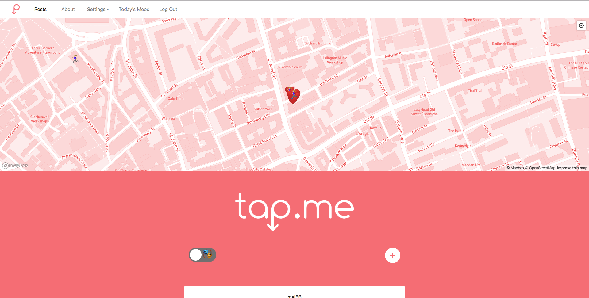

Welcome to Tap.me
==========

Tap.me is a wellbeing web app to combat feelings of isolation. Users can sign up in order to create posts that can be categorised with an emotion or action tag, which can be used later for filtering on the map. Emotion posts will disappear after 24 hours in order to connect with others around you in real time. Happy posting!

Tech stack
------

- Ruby on rails (backend)
- Javascript (frontend)
- Geolocation api
- Database (Postgres)
- Heroku
- Travis
- Capybara/minitest
- Trello
- CSS (bootstrap)

Team
----

Manisha
Mel
Ollie
Jayda

Agile Processes
------
- Two day sprints
- Daily stand-ups
- Pair programming
- Mob programming
- Individual research
- Kanban: https://trello.com/b/U3bkUUpS/tapme

Try now
------
https://tap-me.herokuapp.com
